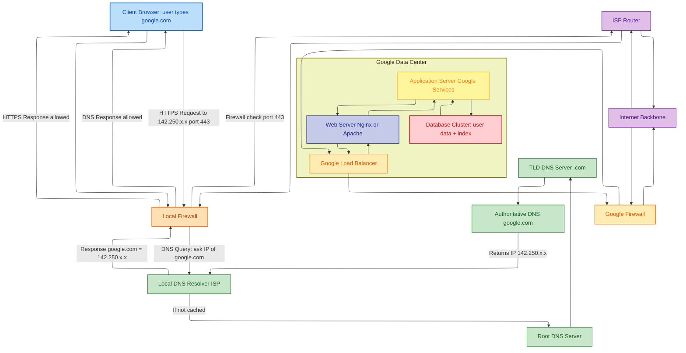

# What happens when you type <https://www.google.com> and hit Enter?

## Check out my detailed blog post explaining what happens when you type `<https://www.google.com>` in your browser: [Read the full article on Medium](https://medium.com/@jeffrey-31/what-happens-when-you-type-https-www-google-com-and-hit-enter-d19588143dc4)

## Blog post content

Most of us just type, press Enter, and boom — Google is there in a blink. But under the hood, there's a lot of moving parts working in milliseconds. Let's break it down step by step.

1.DNS Request
Your browser first asks: "What's the IP of <www.google.com>?"  
The DNS system answers with something like 142.250.xx.xx. Think of it as looking up a phone number in a global directory.

2.TCP/IP Connection
With the IP in hand, your computer now sets up a connection. Packets travel across your local network, your ISP, and then jump through the internet backbone until they reach Google.

3.Firewalls
Along the way, firewalls check your request. They act like security guards: "Is this traffic safe? Port 443 only? Okay, pass."

4.HTTPS / SSL
Since it's HTTPS, your browser and Google exchange keys in a TLS handshake. Certificates are verified, encryption is enabled — so nobody can read your traffic in between.

5.Load Balancer
When your request lands at Google's infrastructure, a load balancer decides: "Which server should handle this?" This keeps traffic smooth and prevents overload.

6.Web Server
The chosen server (often Nginx or Apache) takes the request. Static stuff like images or CSS may be served directly. Anything dynamic gets passed along.

7.Application Server
Here's the brain: Google's application servers run the actual logic, like search. They might need to fetch fresh data before generating the response.

8.Database
When needed, the application servers query huge distributed databases. That's where indexes, user data, and cached results live.

From DNS lookups to encrypted traffic, load balancers, servers, and databases — it's a whole orchestra playing in sync just so that, when you type a URL, a page shows up almost instantly.

